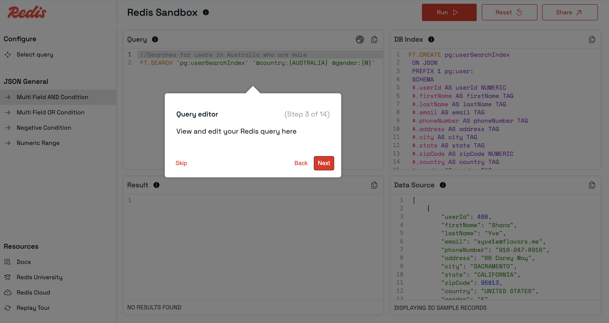
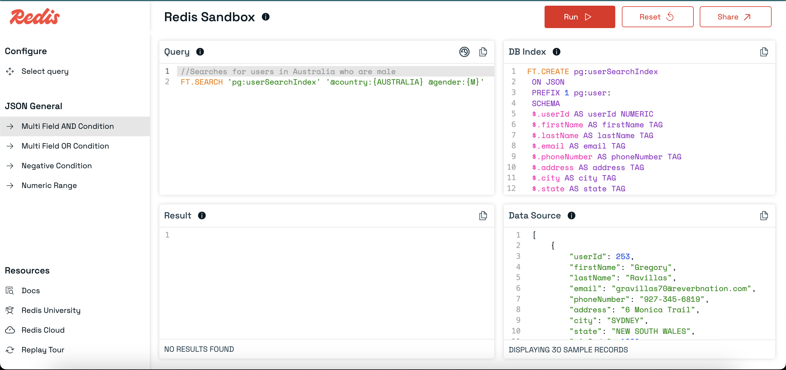
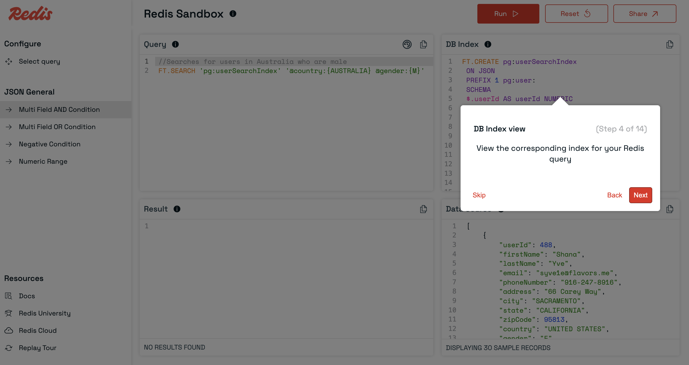
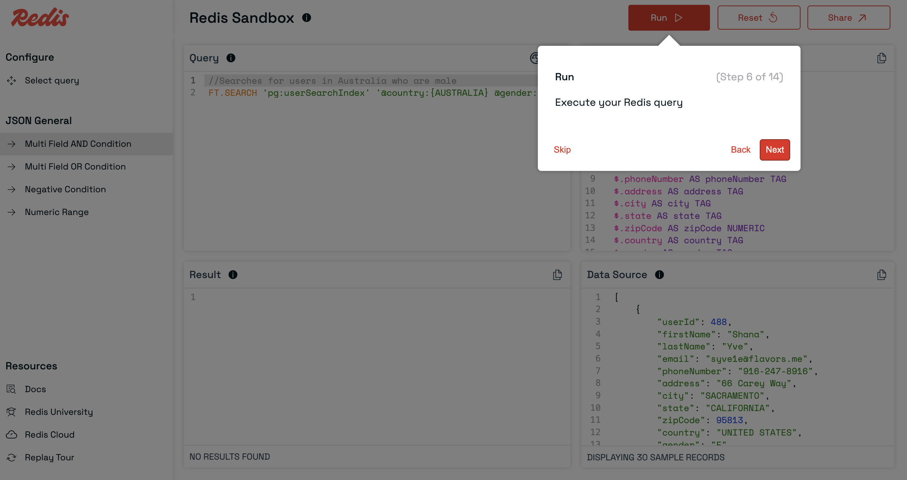
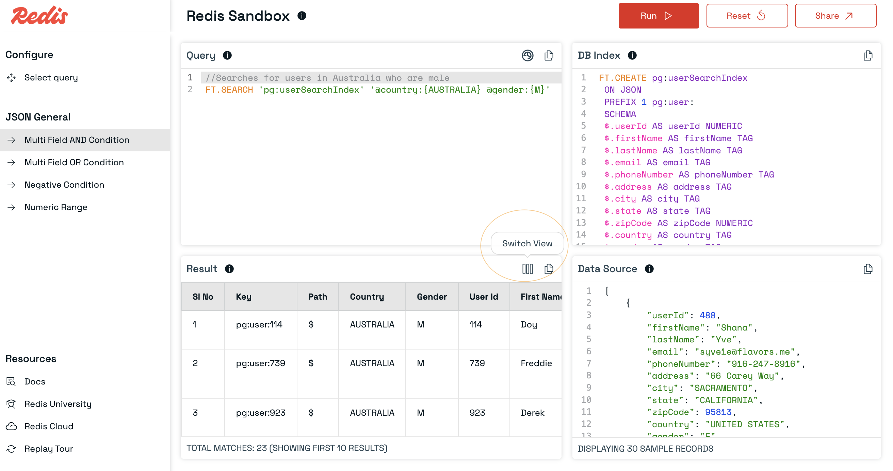
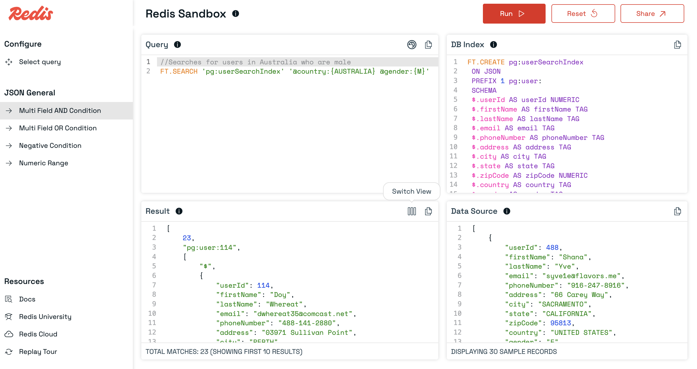
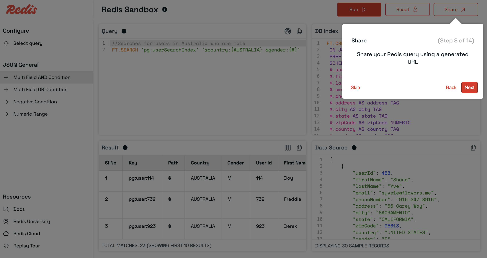
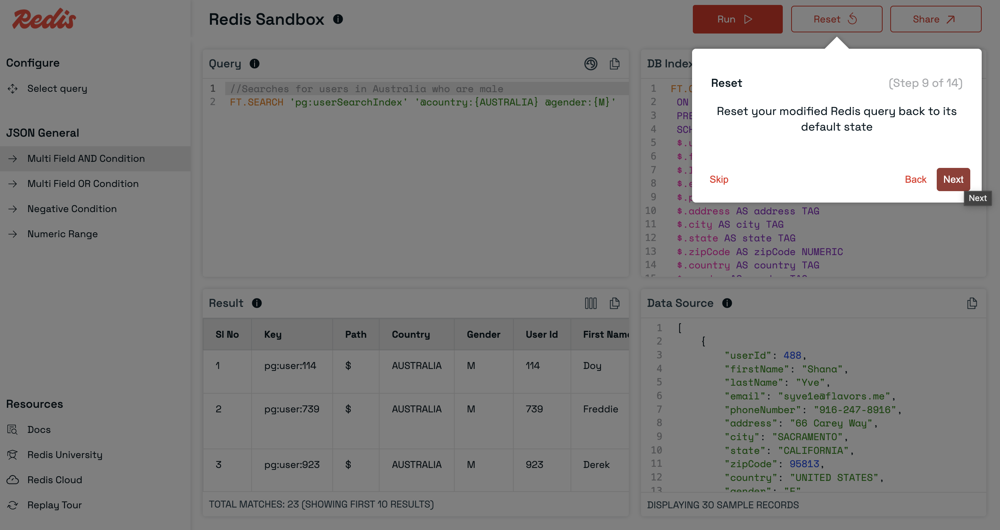
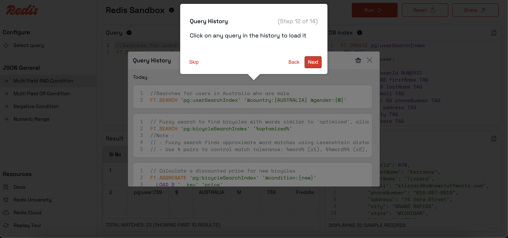

# Redis Sandbox

Redis Sandbox is a tool that allows you to run Redis commands in a sandbox environment.
You can choose existing queries or write your own queries and run them to see the results.

## Product Tour

### URL

Product is hosted at [https://redis.io/try/sandbox/](https://redis.io/try/sandbox/)

### Select existing query

Click on `Select query` from the left sidebar.

`Select query` opens a popup with list of predefined queries.

Click on any query to load it in the query panel.

### Query Panel

Selected query will be displayed in the query panel.

### DBIndex Panel

This panel shows the Index details associated with the selected query.

### DataSource Panel

This panel shows the sample data associated with the selected query and Index.

### Run Query

Click on "Run" button to run the query.

### Results Panel

Results of the query will be displayed in the results panel.

### Toggle Results View

Click on `Switch View` icon in Results panel header to toggle between table view and raw output.

### Share Query

Click on `Share` button to share the query with others.

Note: You can also modify the query and share it with others.

### Reset Query

If you have modified the query, click on `Reset` button to reset the query to the original state.

### Navigate to related queries

Can select related queries in the group by clicking on the query name in the left sidebar.

### Query History

Click on the history icon in the query panel header.

You can view the list of queries you have run successfully in the past.

Can click on any query to load it in the main query panel and also run it again by clicking on `Run` button.

Click on `Delete` button in popup to delete the full query history stored in browser.

### Replay tour

Can click on `Replay tour` link in the left sidebar to replay the product tour through tooltips.

