# How to use Redis Sandbox

Redis Sandbox (also known as Redis Playground) is an interactive tool that lets you experiment with Redis commands in a safe, isolated environment—no setup required. Whether you’re learning Redis, testing queries, or demonstrating features, Redis Sandbox is the perfect place to get hands-on experience.

Main features include:

- Run read queries
- Run write queries (session based)
- View query history
- Share queries (with or without modification)

## Accessing Redis Sandbox

Visit the Redis Sandbox at: [https://redis.io/try/sandbox/](https://redis.io/try/sandbox/)

You’ll be greeted with an interface designed for quick experimentation.

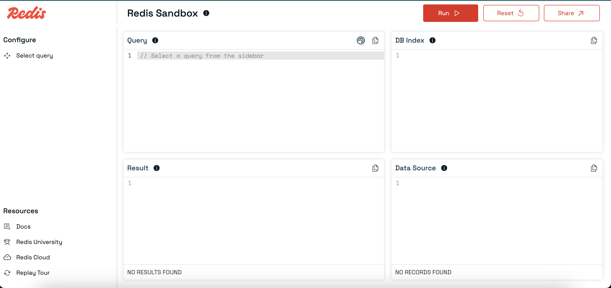

## Exploring the Interface

### Selecting a Predefined Query

- Click `Select query` in the left sidebar.

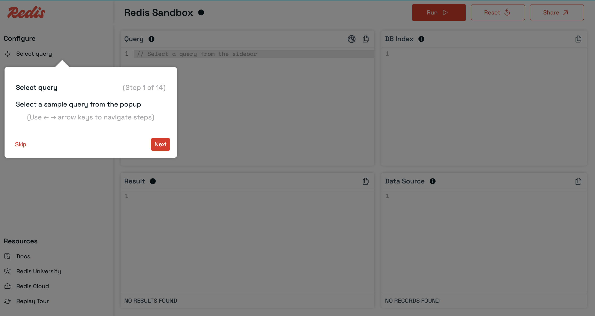

- A popup will appear with a list of predefined queries covering common Redis operations.

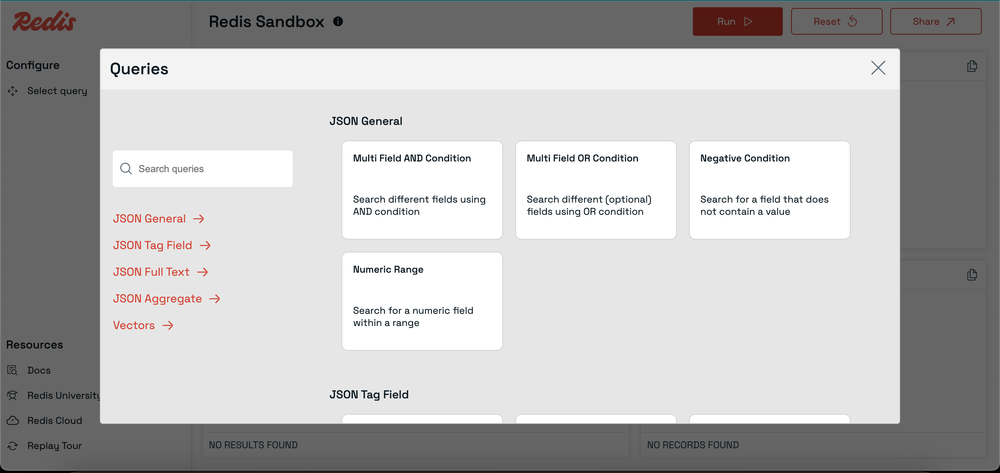

- Click any query to load it into the query editor.

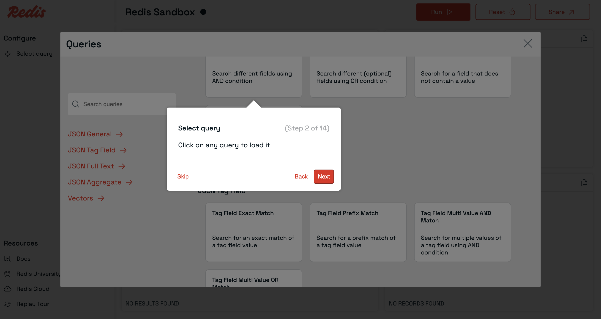

### Writing Your Own Query

- You can also type or paste your own Redis commands directly into the query editor.
- The editor supports multi-line queries and syntax highlighting for better readability.

### Query Panel

- Displays the currently selected or written query.
- You can edit, run, or reset the query here.

### DBIndex Panel

- Shows index details related to the selected query.

### DataSource Panel

- Displays sample data associated with the selected query and index.
- Helps you visualize the data your query will operate on.

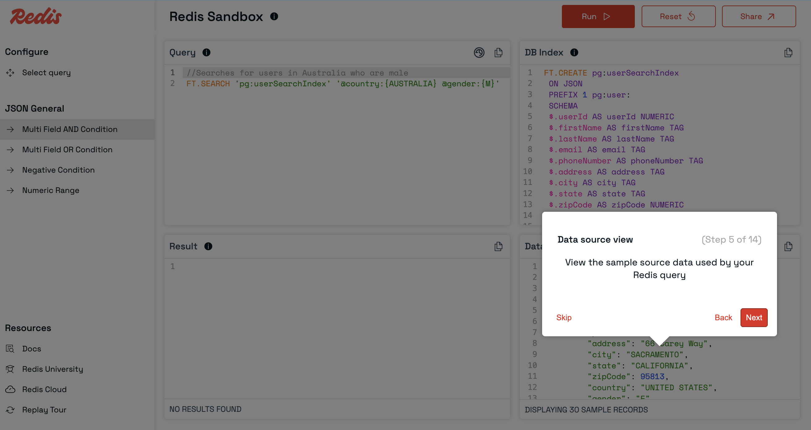

### Run Query

- Click the `Run` button to execute your query.
- The results will appear in the Results panel.

### Results Panel

- View the output of your query in a structured table or as raw text.

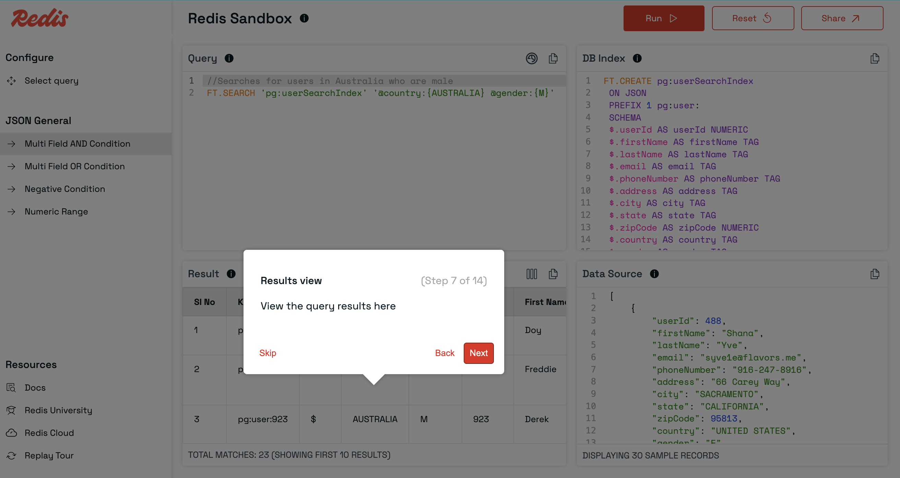

- Toggle between views using the `Switch View` icon in the Results panel header.

### Share Query

- Click the Share button to generate a shareable link for your current query.
- You can also modify the query before sharing.

### Reset Query

- Made changes you want to undo? Click `Reset` to revert to the originally selected query.

### Navigating related queries

- Quickly switch between related queries by clicking their names in the left sidebar.

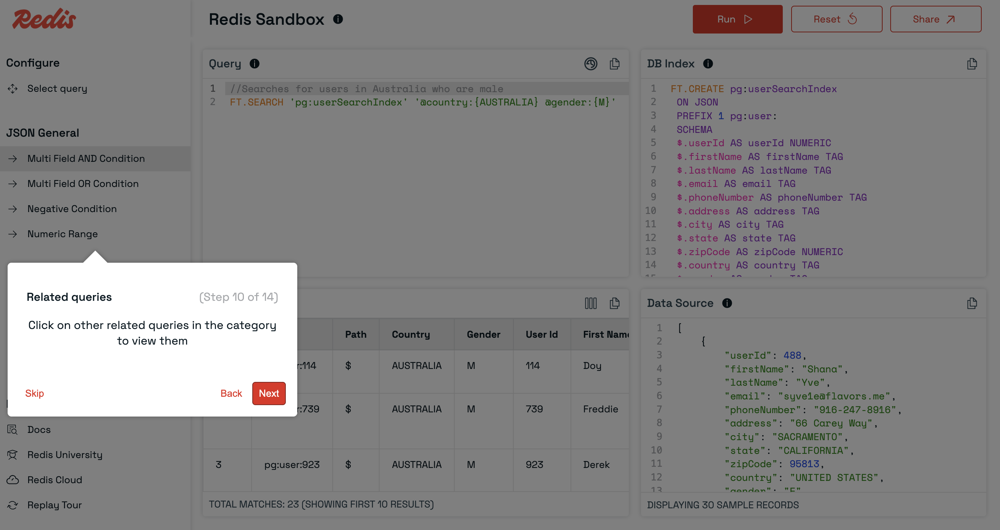

### Query History

- Click the history icon in the query panel header to view your past successful queries.

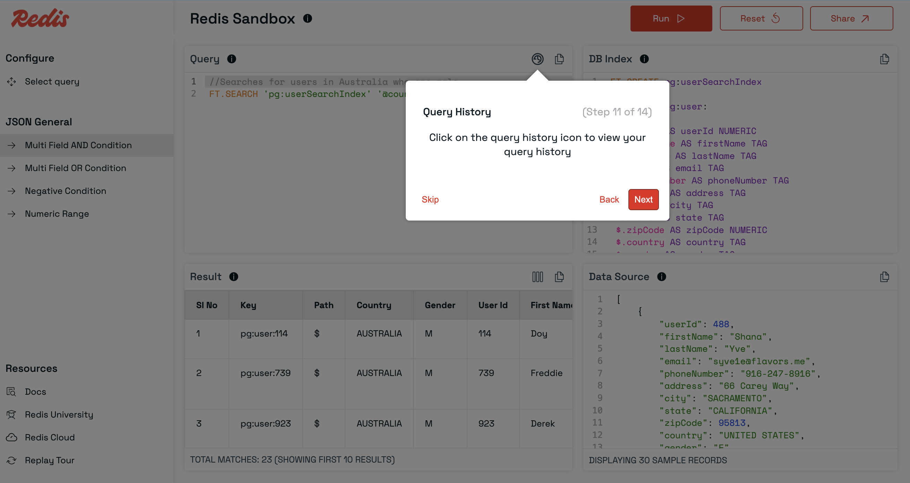

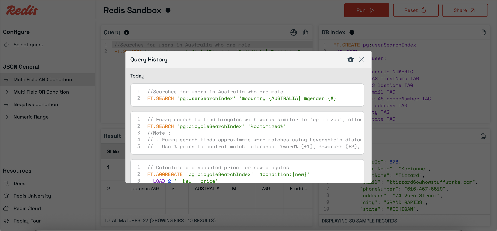

- Reload any previous query with a single click and run it again.

- Delete your query history if needed.

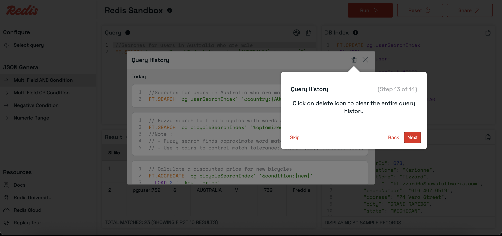

### Replay tour

- Click `Replay tour` in the sidebar to revisit the guided walkthrough.

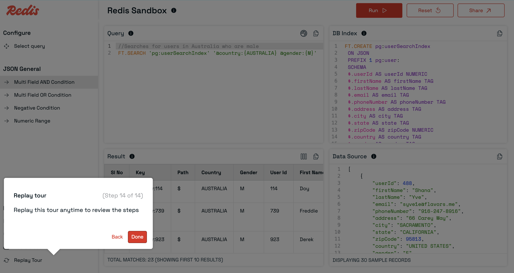

## Session (write) Queries

- When you execute a write query, a unique session is created for you.

Sample write query:
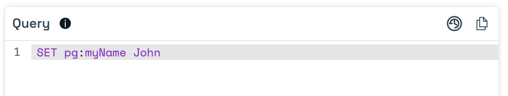

- All subsequent queries in that session will operate on your session’s data.
- Sessions have an expiry setting; data is deleted after the session expires.
- Note: Every key in your write query must use the `pg:` prefix.

**The session status is shown in the header:**

- Before starting a session:
  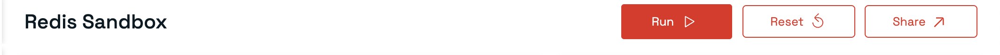

- After starting a session:
  

## Resources

- [Docs](https://redis.io/docs/latest/) - Official Redis documentation.
- [Redis University](https://university.redis.io/) - Free online courses and tutorials.
- [Redis Cloud](https://cloud.redis.io/) - Managed Redis service.
